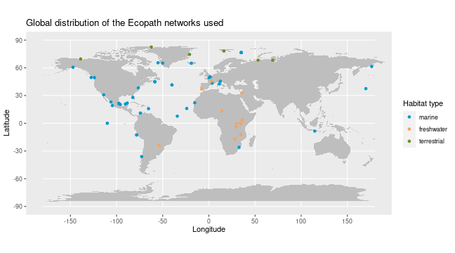

­­

# Load the data
traits <- readRDS("data/intermediate/species_traits.RDS")
interaction <- readRDS("data/intermediate/resolved_inter_table.RDS")
enviro_df <- readRDS("data/enviro_df.RDS")

# Merge the two tables
df <- merge(interaction, traits, by.x = "species_from", by.y = "scientific_name", all.x = TRUE) |>
	subset(select = c("model_name", "species_from", "species_to", "energy_flow", "bodymass")) |>
	dplyr::rename(bodymass_speciesfrom = "bodymass") |>
	merge(traits, by.x = "species_to", by.y = "scientific_name", all.x = TRUE) |>
	subset(select = c("model_name", "species_from", "species_to", "energy_flow", "bodymass_speciesfrom", "bodymass")) |>
	dplyr::rename(bodymass_speciesto = "bodymass") |>
	na.omit()

enviro_model <- unique(df$model_name)
temp <- enviro_df[which(enviro_df$model_name %in% enviro_model),]
temp <- temp[which(temp$model_year > 1970),]
temp_inter <- df[which(df$model_name %in% temp$model_name),]
# Add predator-prey mass ratio (PPMR)
df$ppmr <- (df$bodymass_speciesto)/(df$bodymass_speciesfrom)

# Plot bodymass relations
library(ggplot2)

hist(df$bodymass_speciesfrom)
hist(df$bodymass_speciesto)
ggplot() + geom_point(data = df, aes(y = bodymass_speciesto, x = bodymass_speciesfrom))