```{r setup, echo = F}
knitr::opts_chunk$set(
  comment = "#",
  #cache = TRUE,
  collapse = TRUE,
  warning = FALSE,
  message = FALSE,
  fig.width = 7,
  fig.height = 5.25,
  fig.align = 'center',
  fig.retina = 3
)
library(readr)
library(kableExtra)
mypar = list(mar = c(3,3,0.5,0.5), mgp = c(1.5, 0.3, 0), tck = -.008)
```

class:  middle, title-slide, 

<div class="my-logo-left"></div>
<br><br><br>
# Mécanisme de flux d'énergie en réseaux trophiques 
<br>
<hr width="45%" align="left" size="0.3" color="orange"></hr>
<br>
## Séminaire 1 <br> PBI700
<br>
## .font70[Benjamin Mercier, <br>.small[Étudiant à la maîtrise]]<br><br>
<i class="fa fa-github fa-2x" style="color:#FAFAFA"></i> [BenMerSci/master](https://github.com/BenMerSci/master)

---

# Mise en contexte

.center[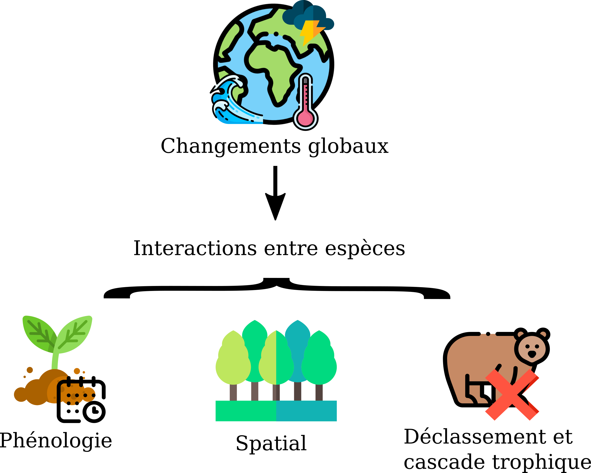]

---

# Mise en contexte (suite)
<p class="box"><br>
.center[**Altération du fonctionnement des écosystèmes et services écosystémiques associés**]
<br></p>

.center[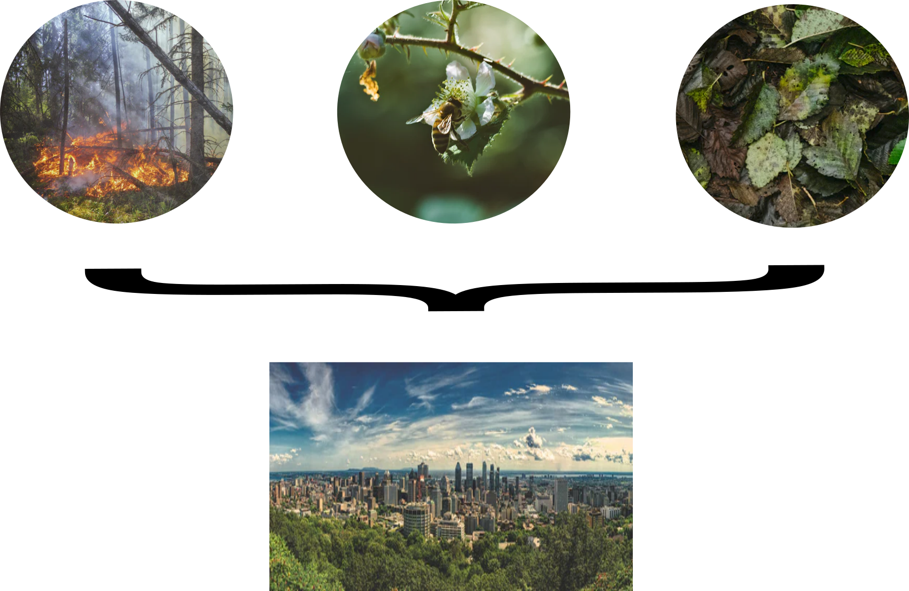]

---

# Justification et importance
<br>
<p class="box"><br>
.center[**Important de comprendre ce qui affecte les interactions entre espèces et comment elles prennent place**]
<br></p>
.center[.Large[&darr;]]


.center[**L'échantillonnage des interactions est complexe**]
<hr width="80%" align="center" size="3.0" color="#23373B"></hr>

.center[Temps]<br>
.center[Éloignement]<br>
.center[Biais]

---

# Justification et importance (suite)

<br>
<p class="box">
<br>
.center[**Le développement de modèle d'inférence et de prédiction est crucial**]
<br></p>
<br>
<hr width="80%" align="center" size="3.0" color="#23373B"></hr>
.center[.Large[&darr;]]

.center[Plusieurs modèles pour reconstituer les réseaux d'interactions existent déjà]
<br>
.center[**mais...**]
<br>
.center[La majorité se concentre sur des réseaux qualitatifs]

---

# Réseaux qualitatifs et quantitatifs

.pull-left[
  .center[**Réseau qualitatif**<br>Topologie]
  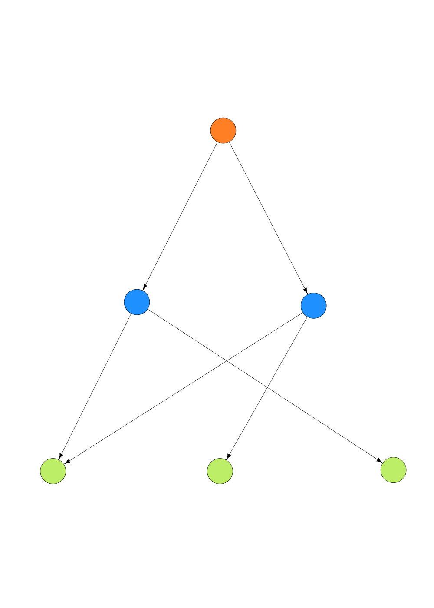
  ]
.pull-right[
  .center[**Réseau quantitatif**<br>Topologie + force]
  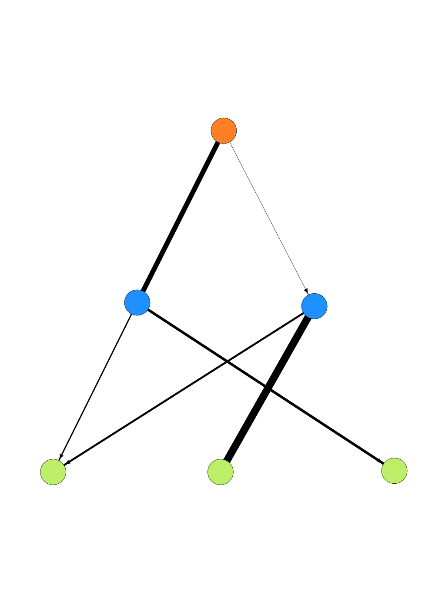
  ]

---

# Réseaux qualitatifs et quantitatifs
.pull-left[
  .center[**Réseaux qualitatifs**<br>
          **Format**]<br>
          
]

.pull-right[
  .center[**Réseaux quantitatifs**<br>
          **Format**]<br>
          
]

---

# Réseaux quantitatifs
<p class="box"><br>
.center[**Important pour comprendre la dynamique et la stabilité des communautés**]
<br></p>
<hr width="100%" align="center" size="3.0" color="#23373B"></hr>
.center[.Large[&darr;]]<br>
.center[Quelques modèles pour reconstituer les forces d'interactions existent déjà]
<br>
.center[**mais...**]
<br>
.center[- Définitions des forces d'interaction variées]
.center[- Peu de modèles mécanistiques]
.center[- Modèles peu ou pas validés]

---

# Flux d'énergie

.center[**Énergie**<br>.font60[(biomasse de carbone/aire/temps)]
]
.center[]<br>
.center[**Potentiel unificateur pour certains domaines de l'écologie**]
<hr width="80%" align="center" size="3.0" color="#23373B"></hr>
<br>
.center[**Relié à certains traits de bases des organismes**]
.center[- Masse corporelle]
.center[- Demande métabolique]
.center[- Abondance/Biomasse]

---

# Modèle mécanistique

.center[**Mécanistique**]
<hr width="80%" align="center" size="3.0" color="#23373B"></hr>

.center[Description et représentation d'un processus selon ses composantes]
.center[.Large[&darr;]]
<br>
.center[Processus = les interactions]
<br>
.center[Composantes = traits des organismes et de l'environnement]
<br>
<hr width="80%" align="center" size="3.0" color="#23373B"></hr>

.center[**Données relativement accessibles!**]

---

class: inverse

# .center[Objectifs]
<br><hr width="80%" align="center" size="2.0" color="orange"></hr>

.center[
1. Développer un modèle mécanistique qui explique de manière précise la distribution des flux d'énergie en réseaux trophiques
<br><br>
<hr width="80%" align="center" size="2.0" color="orange"></hr>
<br>
2. Valider le modèle sur des réseaux de référence (EcoPath) et le comparer à un modèle phénoménologique (RandomForest)
<br><br>
<hr width="80%" align="center" size="2.0" color="orange"></hr>
<br>
3. Définir les paramètres clés par écosystèmes respectifs
<br><br>
<hr width="80%" align="center" size="2.0" color="orange"></hr>

]

---

# Méthodologie

.center[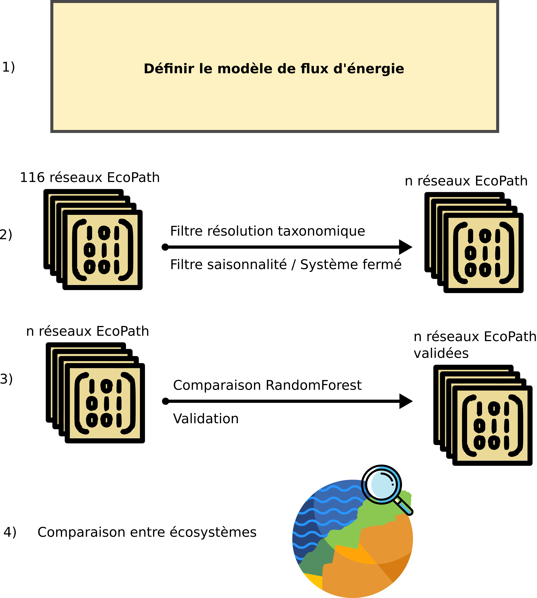]

---

# Composantes d'interactions
<br>
.center[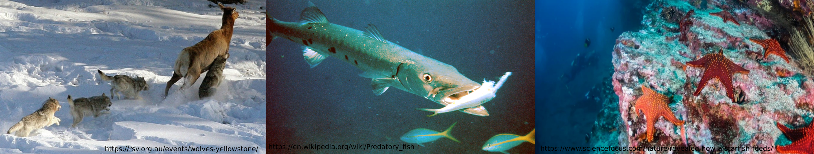]
<hr width="80%" align="center" size="3.0" color="#23373B"></hr>
.center[.Large[&darr;]]
<br>
.center[]

---

# Définir le modèle 
.center[Flux d'énergie de l'espèce *i* à l'espèce *j*]
<hr width="80%" align="center" size="3.0" color="#23373B"></hr>
<br>
.center[
<p class="box">
<br>
$F_{ij}=I_j*E_{ji}*B_i$ 
<br><br>
</p>
<br><br>où
]
.center[
  $I_j$: Demande métabolique du prédateur $_j$<br>
  $E_{ji}$: Taux de consommation du prédateur $_j$ sur la ressource $_i$<br>
  $B_i$: Biomasse de la ressource (C/u²)
]

---

# Réseaux de références

.center[]
<hr width="90%" align="center" size="3.0" color="#23373B"></hr>
<br>
.center[Réseaux trophiques empiriquement échantillonnés]
.center[**...**]
.center[.Large[&darr;]]
.center[**EcoPath**]
.center[- Logiciel de modélisation de réseaux, statique et masse équilibré]

---

# Exemple EcoPath

.center[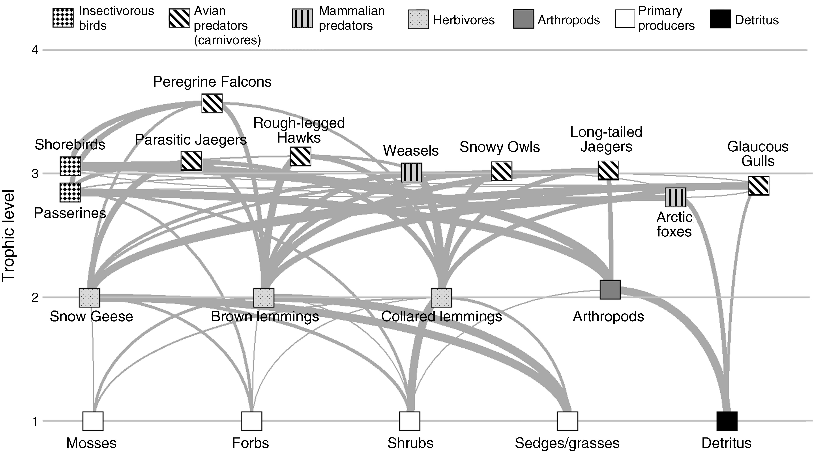]
<hr width="90%" align="center" size="3.0" color="#23373B"></hr>
.center[**Modèle basé sur**]
.center[Biomasse + Production + Consommation + Diète]
.cite[Legagneux et al. 2012]


---

# Action préalable
.center[]
<hr width="90%" align="center" size="3.0" color="#23373B"></hr>
<br>
.center[Filtre taxonomique]
<br>
.center[+]
<br>
.center[Limiter la saisonnalité]

---

# Préalable à la validation

.center[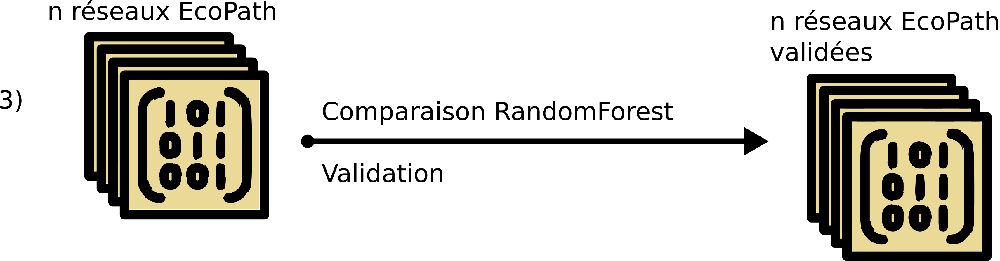]
.center[.font60[Au préalable]]
<hr width="90%" align="center" size="3.0" color="#23373B"></hr>
.center[**Récupérer les différents traits par réseau respectif**]
.center[- Masse moyenne individu adulte]
.center[- Type de métabolisme]
.center[- Dimensionalité de l'interaction]
.center[- Type ou vitesse de déplacement]

---

# Validation

.center[]
<hr width="90%" align="center" size="3.0" color="#23373B"></hr>
.pull-left[
  .center[Optimisation statistique des paramètres du modèle]<br>
    <hr width="80%" align="center" size="3.0" color="#23373B"></hr>
  .center[**Validation et prédiction**]<br>
  .center[Approche *Bottom-up*<br> .font70[(réalisme écologique)]]<br>
]
.pull-right[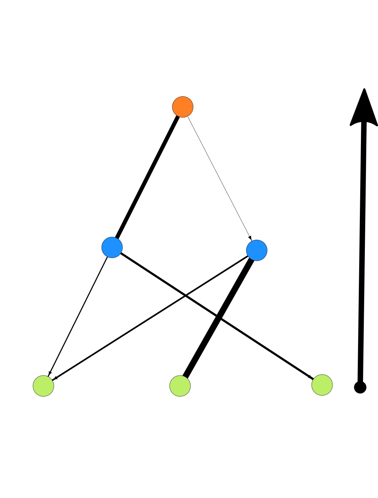]

---

# Mécanistique vs phénoménologique

.center[]
<hr width="90%" align="center" size="3.0" color="#23373B"></hr>
.center[ vs 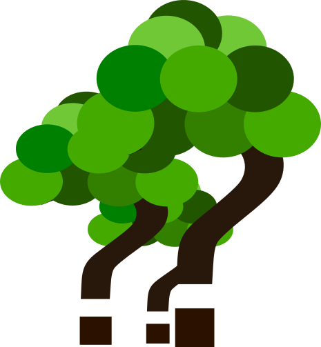]
.center[.Large[&darr;]]
.center[**RandomForest**: Algorithme d'apprentissage machine de base]<br>
.center["Boîte noire" qui classe les variables]
---

# Comparaison inter-écosystème
.center[]
<hr width="90%" align="center" size="3.0" color="#23373B"></hr>

.center[Importance des différents paramètres selon l'écosystème:]<br>
.center[ **Marin, aquatique, terrestre**]
.center[.Large[&darr;]]

.center[Possibilité de raffiner le modèle par écosystème]

---

# Si le temps le permet
.center[**Unification réseaux quantitatifs empiriques et théoriques**]
<hr width="90%" align="center" size="3.0" color="#23373B"></hr>
.center[.Large[&darr;]]
.center[- Peu de réseaux quantitatifs empiriques]
.center[- Déconnection entre échantillonnage empirique et modèle théorique]
.center[- Données de réseaux souvent regroupées]

---

# Remerciements

.pull-left1[

.center[**Mon comité:**<br>
  Dominique Gravel<br>
  Guillaume Blanchet<br>
  Pierre Legagneux<br>
  Laura Pollock<br><br>
**Les membres du laboratoire <br>d'écologie intégrative**<br>
<br>
<p class="box"><br>.center[**Nous remercions le Conseil de Recherches en Sciences Naturelles et Génie du Canada (CRSNG) et le Fonds de recherche Nature et technologies pour leur soutien. En parallèle, le programme BIOS2 est supporté par le CRSNG.**]<br></p>
]]
.pull-rightfin[
  <br>
  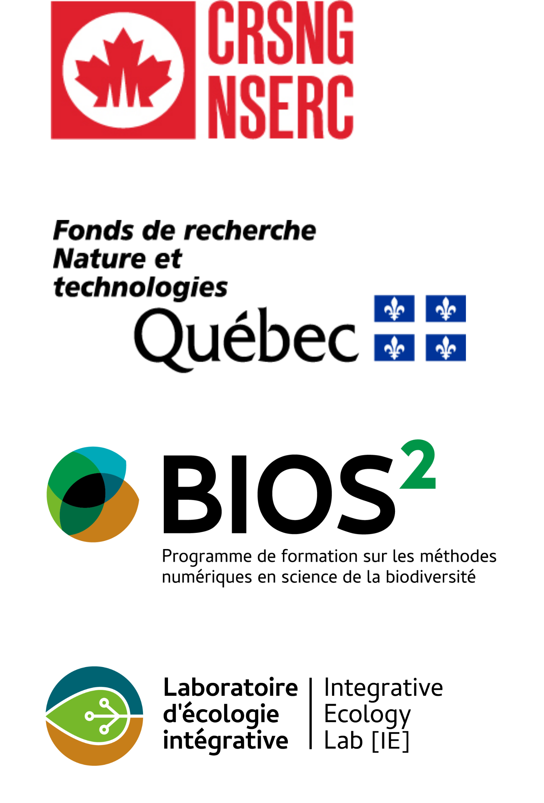]

---

# Icons and photos attributions

**FlatIcons attributions:**<br>
*Earth, Cloud, Thermometer, Waver, Bear, X, Forest, Calendar, Plant, Shoes, Chrono, Cell, Ecosystem, Energy, Mechanism:*
<div>Icons made by <a href="https://www.freepik.com" title="Freepik">Freepik</a> from <a href="https://www.flaticon.com/" title="Flaticon">www.flaticon.com</a></div>
<br>
Locked, Season:<br>
<div>Icons made by <a href="https://www.flaticon.com/authors/eucalyp" title="Eucalyp">Eucalyp</a> from <a href="https://www.flaticon.com/" title="Flaticon">www.flaticon.com</a></div>
<br>
Matrix:<br>
<div>Icons made by <a href="https://www.flaticon.com/authors/vitaly-gorbachev" title="Vitaly Gorbachev">Vitaly Gorbachev</a> from <a href="https://www.flaticon.com/" title="Flaticon">www.flaticon.com</a></div>
Model:<br>
<div>Icons made by <a href="https://www.flaticon.com/authors/becris" title="Becris">Becris</a> from <a href="https://www.flaticon.com/" title="Flaticon">www.flaticon.com</a></div>
Dimension:<br>
<div>Icons made by <a href="https://www.flaticon.com/authors/ultimatearm" title="ultimatearm">ultimatearm</a> from <a href="https://www.flaticon.com/" title="Flaticon">www.flaticon.com</a></div>

**Unsplash photos attributions:**<br>
Forest fire: Landon Parenteau<br>
Pollination: Alex West<br>
Litter: Jesse Dodds <br>
Montreal: Matthias Mullie<br>