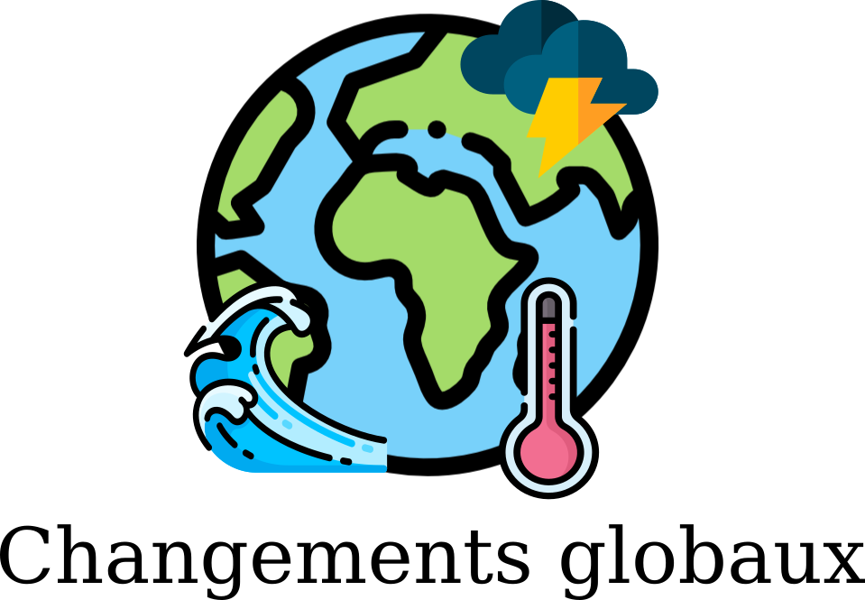

```{r setup, echo = F}
knitr::opts_chunk$set(
  comment = "#",
  #cache = TRUE,
  collapse = TRUE,
  warning = FALSE,
  message = FALSE,
  fig.width = 7,
  fig.height = 5.25,
  fig.align = 'center',
  fig.retina = 3
)
library(readr)
library(kableExtra)
mypar = list(mar = c(3,3,0.5,0.5), mgp = c(1.5, 0.3, 0), tck = -.008)
```

class:  middle, title-slide, 

<div class="my-logo-left"></div>
<br><br><br>
# Modèle mécaniste empiriquement validé de l'inférence de flux d'énergie en réseaux trophiques 
<br>
<hr width="45%" align="left" size="0.3" color="#FFFACD"></hr>
<br>
## Séminaire 1 <br> PBI700
<br><br>
## .font70[Benjamin Mercier, <br>.small[Étudiant à la maîtrise]]

---

# Mise en contexte

.center[]
&darr;

---

# Mise en contexte (suite)

.Large[&darr;]
---

# Justification et importance


---

# Remerciements

.pull-left1[

.center[**Mon comité:**<br>
  -Dominique Gravel<br>
  -Guillaume Blanchet<br>
  -Pierre Legagneux<br>
  -Laura Pollock<br><br>
**Les membres du laboratoire <br>d'écologie intégrative**<br>
<br>
<p class="box"><br>.center[**Nous remercions le Conseil de Recherches en Sciences Naturelles et Génie du Canada (CRSNG) de son soutien. Le programme BIOS2 est supporté par le CRSNG**]<br></p>
]]
.pull-right1[
  <br>
  ]

---

Icon attributions: <br>
Earth: <div>Icons made by <a href="https://www.freepik.com" title="Freepik">Freepik</a> from <a href="https://www.flaticon.com/" title="Flaticon">www.flaticon.com</a></div>

